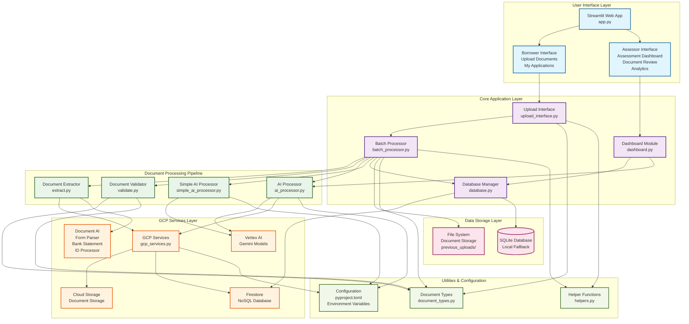
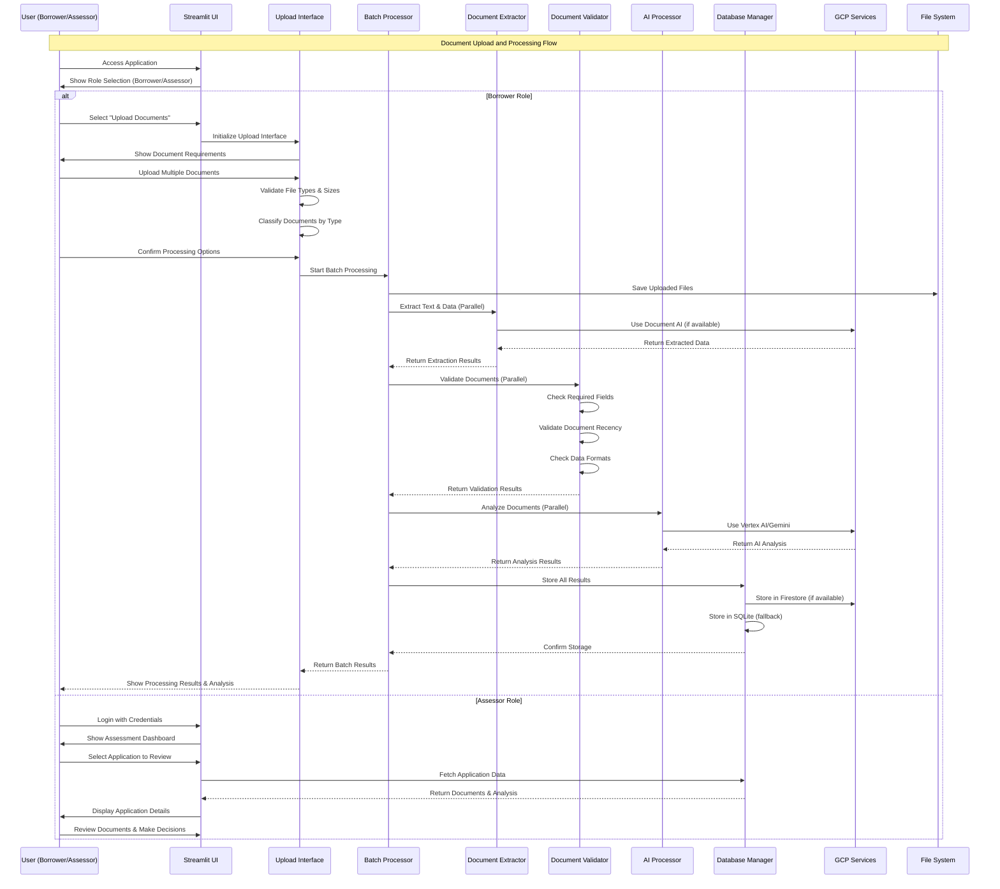
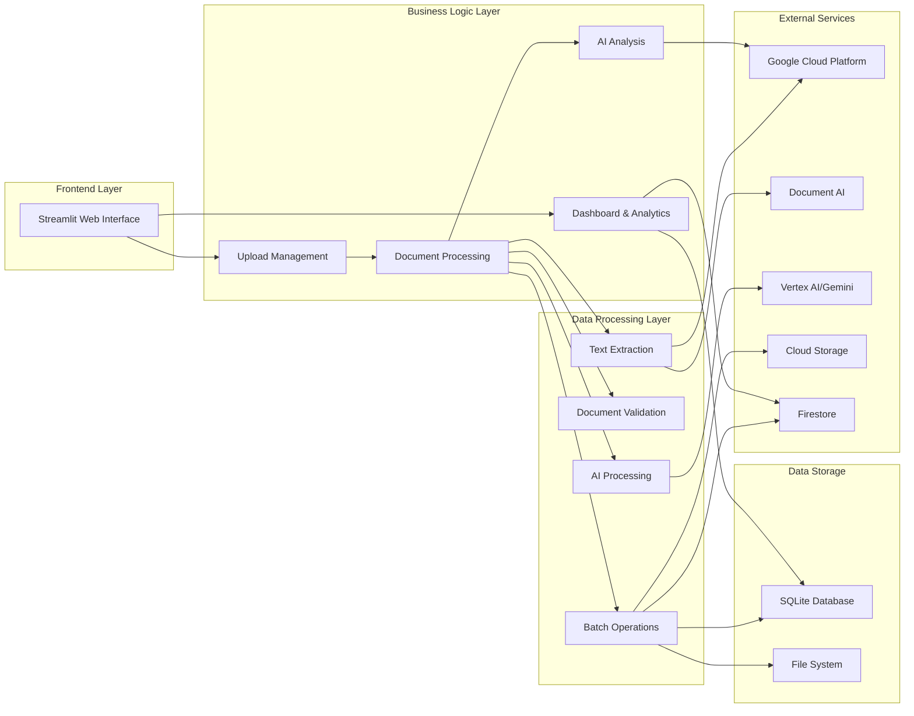
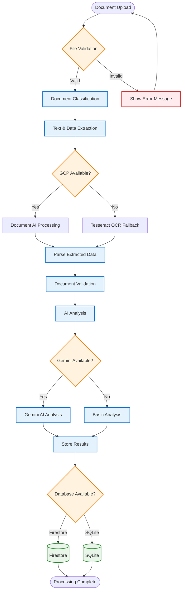

# MortgageFlow System Architecture - Complete Mermaid Diagram

## High-Level System Architecture

## Detailed Data Flow Diagram

## System Components Overview

## Document Processing Pipeline Detail

## Key Features and Capabilities

### 1. **Multi-Role Interface**
- **Borrower Interface**: Document upload, application tracking
- **Assessor Interface**: Document review, analytics, decision making

### 2. **Document Processing Pipeline**
- **Batch Processing**: Handle multiple documents simultaneously
- **Parallel Processing**: Concurrent document analysis for speed
- **Fallback Systems**: Local processing when cloud services unavailable

### 3. **AI-Powered Analysis**
- **Document Summarization**: AI-generated document summaries
- **Fraud Detection**: Automated fraud indicator analysis
- **Risk Assessment**: Application risk evaluation
- **Smart Recommendations**: AI-driven improvement suggestions

### 4. **Robust Data Management**
- **Dual Database Support**: Firestore (cloud) + SQLite (local)
- **File Integrity**: SHA-256 hashing for document verification
- **Comprehensive Validation**: Document type, recency, format validation

### 5. **GCP Integration**
- **Document AI**: Advanced OCR and form parsing
- **Vertex AI**: Gemini models for intelligent analysis
- **Cloud Storage**: Scalable document storage
- **Firestore**: Real-time database for application data

### 6. **User Experience Features**
- **Progress Tracking**: Real-time processing status
- **Interactive Dashboards**: Rich analytics and visualizations
- **Smart Classification**: Automatic document type detection
- **Comprehensive Validation**: Pre-upload file validation

This system provides a complete end-to-end solution for mortgage document automation, combining modern web technologies with advanced AI capabilities and robust cloud infrastructure.
